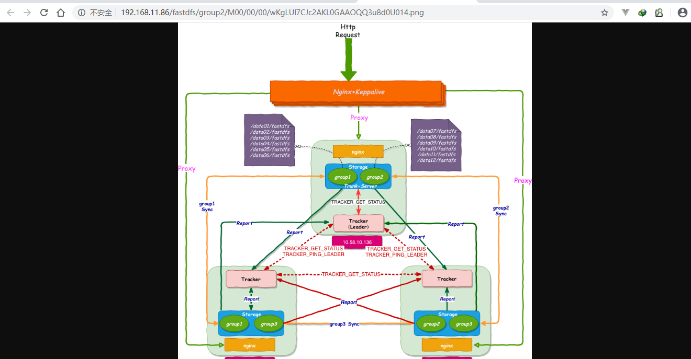

## 一、内容简介

> FastDFS的作者余庆在其 [GitHub](https://github.com/happyfish100) 上是这样描述的：“FastDFS is an open source high performance distributed file system. It's major functions include: file storing, file syncing and file accessing (file uploading and file downloading), and it can resolve the high capacity and load balancing problem. FastDFS should meet the requirement of the website whose service based on files such as photo sharing site and video sharing site” ，意思说，FastDFS是一个开源的高性能分布式文件系统。其主要功能包括：文件存储、文件同步和文件访问（文件上传和文件下载），它可以解决高容量和负载平衡问题。FastDFS应满足基于照片共享站点和视频共享站点等文件的网站的服务要求。


FastDFS 有两个角色：跟踪器（tracker）、存储器（storage）


tracker ：主要负责文件访问的调度和负载均衡。

storage：负责存储文件和文件管理，包括文件存储、文件同步、提供文件访问接口。

> `Tracker` 和 `Storage` 节点都可以由一台或多台服务器构成。这些服务器均可以随时增加或下线而不会影响线上服务，当然各个节点集群至少需要一台服务 `Running`。注意，其中 `Tracker` 集群中的所有服务器都是对等的（P2P），可以根据服务器的压力情况随时增加或减少。
>
> 此外，官网还存储系统做了详尽的说明，为了支持大容量，`Storage` 节点采用了分卷（或分组）的组织方式。存储系统由一个或多个卷组成，卷与卷之间的文件是相互独立的，所有卷的文件容量累加就是整个存储系统中的文件容量。一个卷可以由一台或多台 `Storage` 服务器组成，一个卷下的存储服务器中的文件都是相同的，卷中的多台存储服务器起到了冗余备份和负载均衡的作用。在卷中增加服务器时，同步已有的文件由系统自动完成，同步完成后，系统自动将新增服务器切换到线上提供服务。当存储空间不足或即将耗尽时，可以动态添加卷。只需要增加一台或多台服务器，并将它们配置为一个新的卷，这样就扩大了存储系统的容量。


## 二、虚拟机环境

- 操作系统：Centos 7.x


本次调研模拟分布结构


|  构建对象  | 地址                                                         |
| :--------: | ------------------------------------------------------------ |
|  tracker   | 192.168.11.80   192.168.11.81                                |
|  storage   | 192.168.11.80   192.168.11.81   192.168.11.82   192.168.11.83 |
|   group1   | 192.168.11.80   192.168.11.81                                |
|   group2   | 192.168.11.82   192.168.11.83                                |
| keepalived | 192.168.11.84   192.168.11.85                                |

> 概要精简
>
> 1.核心系统只有两个角色，tracker server和storage server。
>
> 2.所有跟踪器服务器都是对等的，不存在 Master-Slave 关系（
>
> 3.存储服务器采用分组方式，同组内存储服务器上的文件完全相同。
>
> 4.不同组的 storage server 之间不会相互通信，相同组之间会进行同步。
>
> 5.由 storage server 主动向 tracker server 报告状态信息，每个 tracker server 都会记录 storage server 的信息。
>
> 6.如果开启了 trunk 功能，tracker 服务协调 storage 选举 trunk-server。

​		因为是模拟环境所以将80和81既做为tracker又作为storage使用。正常使用时tracker和storage都是单独的节点使用。以上结构搭建完成后我们可以进一步的通过84和85两台主机作nginx+keepalived的代理，提供统一的一个对外的访问地址。（*本文档涉及虚拟主机均已关闭防火墙，若读者在实际操作中遇到服务启动无法访问的情况，请考虑防火墙是否关闭或者开放指定服务端口*）

## 三、集群部署

#### 初始化环境

（若是内网环境则需要离线配置，本文档不做此说明）

```bash
# 安装编译环境
yum groups install Development Tools -y
yum install perl -y
yum -y install redhat-rpm-config.noarch
yum -y install gd-devel
yum -y install perl-devel perl-ExtUtils-Embed
yum -y install pcre-devel
yum -y install openssl openssl-devel
yum -y install gcc-c++ autoconf automake
yum install -y zlib-devel
yum -y install libxml2 libxml2-dev
yum -y install libxslt-devel
yum -y install GeoIP GeoIP-devel GeoIP-data
yum install gperftools -y
```

### 3.1 所需软件说明

| **名称**             | **说明**                                       | 版本                              |
| :------------------- | :--------------------------------------------- | --------------------------------- |
| FastDFS              | FastDFS本体                                    | fastdfs-5.11.tar.gz               |
| libfastcommon        | FastDFS分离出的一些公用函数包                  | libfastcommon_V1.0.39.tar.gz      |
| fastdfs-nginx-module | FastDFS和nginx的关联模块，解决组内同步延迟问题 | fastdfs-nginx-module_V1.20.tar.gz |
| nginx                | nginx                                          | nginx-1.15.8.tar.gz               |
| ngx_cache_purge      | nginx缓存模块提供更高的性能                    | ngx_cache_purge-2.3.tar.gz        |
| keepalived           | 高可用组件                                     |                                   |

### 3.2安装软件包

本文档在/opt目录下获取二进制包

#### (1) 安装libfastcommon

```shell
# libfastcommon
$ wget https://github.com/happyfish100/libfastcommon/archive/V1.0.39.tar.gz
$ mv V1.0.39.tar.gz libfastcommon_V1.0.39.tar.gz
$ tar -zxvf libfastcommon_V1.0.39.tar.gz
# 在解压的目录下执行
$ ./make.sh
$ ./make.sh install
```

`libfastcommon` 安装在了 `/usr/lib64/libfastcommon.so`。需要注意新老版本，新版本在安装之后自动会将 `libfastcommon.so` 通过软连接链接到 `/usr/local/lib` 目录下面。如果是老版本，则需要手动建立：

```shell
ln -s /usr/lib64/libfastcommon.so /usr/local/lib/libfastcommon.so 
ln -s /usr/lib64/libfastcommon.so /usr/lib/libfastcommon.so
```

#### (2) 安装tracker

本例中操作机器地址`192.168.11.80`，`192.168.11.81`

##### a.安装FastDFS

```shell
$ ./make.sh
$ ./make.sh install# FastDFS
$ wget https://github.com/happyfish100/fastdfs/archive/V5.11.tar.gz
$ mv V5.11.tar.gz FastDFS_V5.11.tar.gz
$ tar -zxvf FastDFS_V5.11.tar.gz 
# 在解压的目录下执行
$ ./make.sh
$ ./make.sh install

#安装完成后会生成相应的文件与目录 /etc/fdfs/  配置文件（这三个是作者给的样例配置文件）
#   /etc/fdfs/client.conf.sample
#   /etc/fdfs/storage.conf.sample
#   /etc/fdfs/tracker.conf.sample

# 服务脚本位置
#   /etc/init.d/fdfs_storaged
#   /etc/init.d/fdfs_tracke

$ # 配置文件准备 #tracker节点
$ cp /etc/fdfs/tracker.conf.sample /etc/fdfs/tracker.conf 
```

##### b.修改tracker的配置文件

```shell
$ vim /etc/fdfs/tracker.conf
$ #需要修改的内容如下

#默认256，最大连接数
max_connections=1024 

# tracker 服务器端口（默认 22122,一般不修改）
port=22122 

# 存储日志和数据的根目录（自定义目录，提前创建）
base_path=/data/fastdfs/tracker
```

##### c.启动`tracker`服务

```shell
$ service fdfs_trackerd start
# 查看启动进程
$ netstat -unltp|grep fdfs

	tcp  0   0 0.0.0.0:22122   0.0.0.0:*  LISTEN      1071/fdfs_trackerd 
 
```

#### (3) 安装storage

本例中操作机器地址

- group1(`192.168.11.80`，`192.168.11.81`)
- group2(`192.168.11.82`，`192.168.11.83`)

FastDFS安装步骤同tracker相同。

##### a.配置group1

​	由于`192.168.11.80`，`192.168.11.81`中我们已经安装FastDFS并启动了tracker，因此只需要再配置启动storage即可。

```shell
#复制存储器样例文件storage.conf.sample，并重命名为storage.conf
cp /etc/fdfs/storage.conf.sample /etc/fdfs/storage.conf
```

修改`storage.conf`配置

```bash
# 配置文件是否不生效，false 为生效
disabled=false 

# 指定此 storage server 所在 组(卷)
group_name=group1

# storage server 服务端口
port=23000

# 心跳间隔时间，单位为秒 (这里是指主动向 tracker server 发送心跳)
heart_beat_interval=30

# Storage 数据和日志目录地址(根目录必须存在，子目录会自动生成)
base_path=/data/fastdfs/storage

# 存放文件时 storage server 支持多个路径。这里配置存放文件的基路径数目，通常只配一个目录。
store_path_count=1


# 逐一配置 store_path_count 个路径，索引号基于 0。
# 如果不配置 store_path0，那它就和 base_path 对应的路径一样。
store_path0=/data01/fastdfs

# FastDFS 存储文件时，采用了两级目录。这里配置存放文件的目录个数。 
# 如果本参数只为 N（如： 256），那么 storage server 在初次运行时，会在 store_path 下自动创建 N * N 个存放文件的子目录。
subdir_count_per_path=256

# tracker_server 的列表 ，会主动连接 tracker_server
# 有多个 tracker server 时，每个 tracker server 写一行
tracker_server=192.168.11.80:22122
tracker_server=192.168.11.81:22122

# 允许系统同步的时间段 (默认是全天) 。一般用于避免高峰同步产生一些问题而设定。
sync_start_time=00:00
sync_end_time=23:59

# 访问端口
http.server_port=8888
```

##### b.配置group2

​	将`192.168.11.82`，`192.168.11.83`中的`group_name=group1`改为`group_name=group2`。

`store_path0=/data01/fastdfs`文件目录需要提前创建。


##### c.启动`storage`服务

```shell
$ service fdfs_storaged start
$ netstat -unltp|grep fdfs
```

**如若需要可设置Storage和Tracker开机自启**

```shell
$ chkconfig fdfs_storaged on
$ chkconfig fdfs_trackerd on
```

**查看Storage和Tracker是否在通信**

```shell
/usr/bin/fdfs_monitor /etc/fdfs/storage.conf
```

/Typora/data/user-image/image-20200518173453078.png)


##### d.上传测试

```
/etc/fdfs`目录下，复制FastDFS跟踪器样例配置文件`client.conf.sample`，并重命名为`client.conf
```

```shell
$ cp /etc/fdfs/client.conf.sample /etc/fdfs/client.conf
```

修改`client.conf`配置

```bash
# Client 的数据和日志目录
base_path=/data/fastdfs/client

# Tracker端口
tracker_server=192.168.11.80:22122
tracker_server=192.168.11.81:22122

# HTTP端口
http.tracker_server_port=80
```

上传文件

```shell
$ /usr/bin/fdfs_upload_file /etc/fdfs/client.conf ll.zip 
```

上传成功后返回文件ID号：group2/M00/00/00/wKgLU17CB62ADy-HAAAAqoZV9hQ128.zip

/Typora/data/user-image/image-20200518174141566.png)

返回的ID由group、存储目录、两级子目录、fileid、文件后缀名（由客户端指定，主要用于区分文件类型）组成。


### 3.3 Nginx配置

#### (1) storage节点nginx配置

​		使用二进制安装包离线进行安装，如遇到缺少环境变量同样需要离线rpm安装环境变量（嫌麻烦直接yum安装相关环境变量即可）。[离线安装参考链接](https://blog.csdn.net/MyMBS/article/details/90719902)

> ​		将文件放在Storage服务器存储，但是同组存储服务器之间需要进入文件复制，有同步延迟的问题。假设Tracker服务器将文件上传到了192.168.4.125，上传成功后文件ID已经返回给客户端。此时FastDFS存储集群机制会将这个文件同步到同组存储192.168.4.126，在文件还没有复制完成的情况下，客户端如果用这个文件ID在192.168.4.126上取文件,就会出现文件无法访问的错误。而fastdfs-nginx-module可以重定向文件连接到源服务器取文件,避免客户端由于复制延迟导致的文件无法访问错误。


下载`fastdfs-nginx-module`模块包，在[nginx官网](http://nginx.org/en/download.html)下载需要地版本包。

```shell
1.安装整合包fastdfs-nginx-module_V1.20.tar.gz
$ wget https://github.com/happyfish100/fastdfs-nginx-module/archive/V1.20.tar.gz
$ mv V1.20.tar.gz fastdfs-nginx-module_V1.20.tar.gz
$ tar -zxvf fastdfs-nginx-module_V1.20.tar.gz -C /usr/local/

#然后修改 fastdfs-nginx-module-1.20/src/config 文件，找到 ngx_module_incs 和 CORE_INCS 两处，修改如下：
ngx_module_incs=”/usr/include/fastdfs /usr/include/fastcommon/”
CORE_INCS=”$CORE_INCS /usr/include/fastdfs /usr/include/fastcommon/”

#如果不修改，在编译 nginx 的时候，会出这种错误：
/usr/include/fastdfs/fdfs_define.h:15:27: fatal error: common_define.h: No such file or directory


```


```shell
2.安装Nginx 加载fastdfs-nginx-module模块

tar -zxvf  nginx-1.15.8.tar.gz

cd nginx-1.15.8

#加载fastdfs-nginx-module模块
./configure --prefix=/usr/local/nginx --add-module=/usr/local/fastdfs-nginx-module-1.20/src/
#编译
make
#安装
make install


3.修改整合模块配置
cp /usr/local/fastdfs-nginx-module/src/mod_fastdfs.conf /etc/fdfs/ 

vim /etc/fdfs/mod_fastdfs.conf

修改内容：
注意：第一组(80、81)和第二组(82、83) 节点修改内容，只有组名不同 
base_path=/data/fastdfs
# 连接超时时间
connect_timeout=10
# Tracker Server
tracker_server=192.168.11.80:22122
tracker_server=192.168.11.81:22122
# StorageServer 默认端口
storage_server_port=23000
# 如果文件ID的uri中包含/group**，则要设置为true
url_have_group_name=true
# Storage 配置的store_path0路径，必须和storage.conf中的一致
store_path0=/data01/fastdfs
#第一组为 group1  第二组为 group2 
group_name=group1 
group_count=2
 
 
#追加以下内容 
[group1] 
group_name=group1 
storage_server_port=23000 
store_path_count=1 
store_path0=/data01/fastdfs
 
[group2] 
group_name=group2 
storage_server_port=23000 
store_path_count=1 
store_path0=/data01/fastdfs

4.复制配置文件
# 进入FastDFS包的解压目录 ,供 nginx 访问使用
cp http.conf mime.types /etc/fdfs/

5.创建软连接，在/data01/fastdfs 文件存储目录下创建软连接，将其链接到实际存放数据的目录。
ln -s /data01/fastdfs/data/ /data01/fastdfs/data/M00 
6.修改 Nginx 配置文件4个节点 
命令：vim usr/local/nginx.conf 
修改内容：
listen 8888; 
server_name localhost; 
location ~/group([0-9])/M00 { 
    #alias /fastdfs/storage/data; 
    ngx_fastdfs_module; 
}
启动4个节点Nginx: /usr/local/nginx/sbin/nginx -c /usr/local/nginx/conf/nginx.conf
```


#### (2) tracker节点nginx配置

​		由于本例子中，`192.168.11.80`，`192.168.11.81`同时作为tracker和storage，在tracker上安装的nginx主要为了提供http访问的反向代理、负载均衡以及缓存服务。因此在此需要在这两个节点上的ngixn添加其他配置。并且添加缓存模块提升负载性能。

```shell
1.安装ngx_cache_purge-2.3.tar.gz（清除指定url的缓存）
tar -zxvf ngx_cache_purge-2.3.tar.gz –C /usr/local/

2.安装Nginx  加入 ngx_cache_purge (加入清除缓存模块)
 #进入ngixn的解压目录，除了添加fastdfs-nginx-module-1.20 在添加ngx_cache_purge-2.3
./configure --add-module=/usr/local/fastdfs-nginx-module-1.20/src/ --add-module=/usr/local/ngx_cache_purge-2.3/

#输入make进行编译，千万不要make install 因为会覆盖原来已经安装好的内容，另外，编译必须没错误才行
make

# 确认没有问题后，将解压目录下的objs/nginx复制到/usr/local/nginx/sbin/
# 先备份
cp /usr/local/nginx/sbin/nginx  /usr/local/nginx/sbin/nginx-bak
cp objs/nginx usr/local/nginx/sbin/

# 查看是否成功
/usr/local/nginx/sbin/nginx -V
#出现内容如下代表成功
nginx version: nginx/1.15.8
built by gcc 4.8.5 20150623 (Red Hat 4.8.5-39) (GCC) 
configure arguments: --prefix=/usr/local/nginx --add-module=/usr/local/ngx_cache_purge-2.3/ --add-module=/usr/local/fast-nginx-module/fastdfs-nginx-module-1.20/src/


3.修改nginx配置
vim /usr/local/nginx/conf/nginx.conf
修改添加内容
events { 
    worker_connections  1024;  
    use epoll; 
} 
http { 
    include       mime.types; 
    default_type  application/octet-stream; 
    sendfile        on; 
    tcp_nopush     on; 
    keepalive_timeout  65; 
    #设置缓存 
    server_names_hash_bucket_size 128;    
    client_header_buffer_size 32k;    
    large_client_header_buffers 4 32k;    
    client_max_body_size 300m;   
 
    proxy_redirect off; 
    proxy_set_header Host $http_host; 
   
    proxy_set_header Cookie $http_cookie; 
   
    proxy_set_header X-Real-IP $remote_addr; 
   
    proxy_set_header X-Forwarded-For $proxy_add_x_forwarded_for; 
 
    proxy_connect_timeout 90;    
    proxy_read_timeout 90;    
    proxy_send_timeout 90;    
    proxy_buffer_size 16k;    
    proxy_buffers 4 64k;    
    proxy_busy_buffers_size 128k;    
    proxy_temp_file_write_size 128k;   
    #设置缓存存储路径、存储方式、分配内存大小、磁盘最大空间、缓存期限
    proxy_cache_path /data/fastdfs/cache/nginx/proxy_cache levels=1:2 
    keys_zone=http-cache:200m max_size=1g inactive=30d; 
    proxy_temp_path /data/fastdfs/cache/nginx/proxy_cache/tmp; 
 
    # weight 权重  max_fails 失败重试次数 fail_timeout 连接失败超时时间 
    #设置 group1 的服务器 
    upstream fdfs_group1 { 
        server 192.168.11.80:8888 weight=1 max_fails=2 fail_timeout=30s; 
        server 192.168.11.81:8888 weight=1 max_fails=2 fail_timeout=30s; 
    } 
 
    #设置 group2 的服务器 
    upstream fdfs_group2 { 
         server 192.168.11.82:8888 weight=1 max_fails=2 fail_timeout=30s; 
         server 192.168.11.83:8888 weight=1 max_fails=2 fail_timeout=30s;
    } 
 
 
 server { 
        listen       8000; 
        server_name  localhost; 
        #charset koi8-r; 
        #access_log  logs/host.access.log  main; 
 
        #设置 group 的负载均衡参数 
        location /group1/M00 { 
           proxy_next_upstream http_502 http_504 error timeout invalid_header; 
            proxy_cache http-cache; 
            proxy_cache_valid  200 304 12h; 
            proxy_cache_key $uri$is_args$args; 
            proxy_pass http://fdfs_group1; 
            expires 30d; 
        } 
 
         location /group2/M00 { 
            proxy_next_upstream http_502 http_504 error timeout invalid_header; 
            proxy_cache http-cache; 
            proxy_cache_valid 200 304 12h; 
            proxy_cache_key $uri$is_args$args; 
            proxy_pass http://fdfs_group2; 
            expires 30d; 
        } 
 
 
        #设置清除缓存的访问权限 
        location ~/purge(/.*) { 
            allow 127.0.0.1; 
            allow 192.168.1.0/24; 
            deny all; 
            proxy_cache_purge http-cache $1$is_args$args; 
        } 
        #error_page  404              /404.html; 
        # redirect server error pages to the static page /50x.html 
        # 
        error_page   500 502 503 504  /50x.html; 
        location = /50x.html { 
            root html;  
        } 
}


4.按以上nginx 配置文件的要求，创建对应的缓存目录2个跟踪器节点都需要：  
mkdir -p /data/fastdfs/cache/nginx/proxy_cache
mkdir -p /data/fastdfs/cache/nginx/proxy_cache/tmp

#重启nginx
/usr/local/nginx/sbin/nginx -s reload
```

#### (3) 测试

测试下载：	

​	访问 http://192.168.11.80:8000/group2/M00/00/00/wKgLU17CB62ADy-HAAAAqoZV9hQ128.zip 可获取到下载链接。


****

测试图片：

```shell
[root@localhost client]# /usr/bin/fdfs_upload_file /etc/fdfs/client.conf ts.png 
group2/M00/00/00/wKgLUl7CJc2AKL0GAAOQQ3u8d0U014.png
```


两个tracker节点均可访问成功，到此FastDFS集群部分部署完成。


## 四、安装keepalived+nginx

目的：对tracker提供负载均衡并对外外提供统一访问IP，实现高可用。

#### 4.1 nginx安装	

​		安装过程参考上面的安装步骤。

​		配置nginx.conf

```
修改nginx配置
vim /usr/local/nginx/conf/nginx.conf


修改内容：
upstream fastdfs_tracker {
    server 192.168.11.80:8000 weight=1 max_fails=2 fail_timeout=30s; 
    server 192.168.11.81:8000 weight=1 max_fails=2 fail_timeout=30s; 
}
server { 
        listen       80; 
        server_name  localhost; 
        location / { 
            root html; 
            index  index.html index.htm; 
        } 
        error_page   500 502 503 504  /50x.html; 
        location = /50x.html { 
            root html; 
        } 
 
        ## FastDFS Proxy 代理路径设置为 /fastdfs 
        location /fastdfs { 
            root   html; 
            index  index.html index.htm; 
            proxy_pass  http://fastdfs_tracker/; 
            proxy_set_header Host  $http_host; 
            proxy_set_header Cookie $http_cookie; 
            proxy_set_header X-Real-IP $remote_addr; 
            proxy_set_header X-Forwarded-For $proxy_add_x_forwarded_for; 
            proxy_set_header X-Forwarded-Proto $scheme; 
            client_max_body_size  300m; 
        } 
}
```

启动nginx

```
/nginx/usr/local/nginx/sbin/nginx  -c  	/nginx/usr/local/nginx/conf/nginx.conf
```

两台主机都要做nginx安装配置。


#### 4.2 keepalived安装	

[	下载keepalived](https://www.keepalived.org/)

```shell
# 解压
tar -zxvf  keepalived-2.0.20.tar.gz -C /usr/local/src
cd /usr/local/src keepalived-2.0.20
# 配置安装目录，如遇到缺少环境报错则需要先进行相关环境的安装，然后再次执行下面的命令
./configure --prefix=/usr/local/keepalived

# 进行编译和安装
make && make install

# 创建目录
mkdir /etc/keepalived

# 复制配置文件
cp /usr/local/keepalived/etc/keepalived/keepalived.conf  /etc/keepalived/
# 拷贝执行文件
cp /usr/local/keepalived/sbin/keepalived /usr/sbin/
```

```bash
# 编辑创建开机启动内容
vi /etc/init.d/keepalived


#!/bin/sh
#
# keepalived   High Availability monitor built upon LVS and VRRP
#
# chkconfig:   - 86 14
# description: Robust keepalive facility to the Linux Virtual Server project \
#              with multilayer TCP/IP stack checks.

### BEGIN INIT INFO
# Provides: keepalived
# Required-Start: $local_fs $network $named $syslog
# Required-Stop: $local_fs $network $named $syslog
# Should-Start: smtpdaemon httpd
# Should-Stop: smtpdaemon httpd
# Default-Start: 
# Default-Stop: 0 1 2 3 4 5 6
# Short-Description: High Availability monitor built upon LVS and VRRP
# Description:       Robust keepalive facility to the Linux Virtual Server
#                    project with multilayer TCP/IP stack checks.
### END INIT INFO

# Source function library.
. /etc/rc.d/init.d/functions

exec="/usr/sbin/keepalived"
prog="keepalived"
config="/etc/keepalived/keepalived.conf"

[ -e /etc/sysconfig/$prog ] && . /etc/sysconfig/$prog

lockfile=/var/lock/subsys/keepalived

start() {
    [ -x $exec ] || exit 5
    [ -e $config ] || exit 6
    echo -n $"Starting $prog: "
    daemon $exec $KEEPALIVED_OPTIONS
    retval=$?
    echo
    [ $retval -eq 0 ] && touch $lockfile
    return $retval
}

stop() {
    echo -n $"Stopping $prog: "
    killproc $prog
    retval=$?
    echo
    [ $retval -eq 0 ] && rm -f $lockfile
    return $retval
}

restart() {
    stop
    start
}

reload() {
    echo -n $"Reloading $prog: "
    killproc $prog -1
    retval=$?
    echo
    return $retval
}

force_reload() {
    restart
}

rh_status() {
    status $prog
}

rh_status_q() {
    rh_status &>/dev/null
}


case "$1" in
    start)
        rh_status_q && exit 0
        $1
        ;;
    stop)
        rh_status_q || exit 0
        $1
        ;;
    restart)
        $1
        ;;
    reload)
        rh_status_q || exit 7
        $1
        ;;
    force-reload)
        force_reload
        ;;
    status)
        rh_status
        ;;
    condrestart|try-restart)
        rh_status_q || exit 0
        restart
        ;;
    *)
        echo $"Usage: $0 {start|stop|status|restart|condrestart|try-restart|reload|force-reload}"
        exit 2
esac
exit $?
```

```shell
# 添加权限
chmod a+x /etc/init.d/keepalived 

# 加入开机启动
chkconfig --add /etc/init.d/keepalived
chkconfig keepalived on

至此可以使用如下快捷方式操作
service keepalived start
service keepalived restart
service keepalived reload
service keepalived stop
```

编辑keepalived配置文件

> router_id 是路由标识，在一个局域网里面应该是唯一的；
>
> vrrp_instance VI_1{...}这是一个VRRP实例，定义了keepalived的主备状态、接口、优先级、认证和IP信息；
>
>   state 定义了VRRP的角色;
>
>   interface定义使用的接口，这里我的服务器用的网卡都是eth1,根据实际来填写
>
>   virtual_router_id是虚拟路由ID标识，一组的keepalived配置中主备都是设置一致
>
>   priority是优先级，数字越大，优先级越大
>
>   auth_type是认证方式
>
>   auth_pass是认证的密码
>
>   virtual_ipaddress ｛...｝定义虚拟IP地址，可以配置多个IP地址

```
vim /etc/keepalived/keepalived.conf
# 主服务器 192.168.11.84
! Configuration File for keepalived

global_defs {
   notification_email {
     acassen@firewall.loc
     failover@firewall.loc
     sysadmin@firewall.loc
   }
   notification_email_from Alexandre.Cassen@firewall.loc
   smtp_server 192.168.200.1
   smtp_connect_timeout 30
   # router_id 是路由标识，在一个局域网里面应该是唯一的；在备机中要配置不同
   router_id lb84
}


vrrp_script chk_nginx {
    script "/etc/keepalived/nginx_check.sh" ##执行脚本位置
    interval 2 ##检测时间间隔
    weight -20 ## 如果条件成立则权重减20（-20）
}


vrrp_instance VI_1 {
	# 备机中为 BACKUP
    state MASTER
    #绑定虚拟IP的网络接口（网卡），与本机IP地址所在的网络接口相同（我这里是ens33）
    interface ens33
    virtual_router_id 51
    #优先级，数字越大，优先级越大，该值大于备机中值的时候只要主节点重新上线就会抢夺VIP
    priority 150
    advert_int 1
    authentication {
        auth_type PASS
        auth_pass 1111
    }


    track_script {
        chk_nginx
    }


    virtual_ipaddress {
        192.168.11.86
      
    }
}


```

```
vim /etc/keepalived/keepalived.conf

# 备用服务器 192.168.11.85

! Configuration File for keepalived

global_defs {
   notification_email {
     acassen@firewall.loc
     failover@firewall.loc
     sysadmin@firewall.loc
   }
   notification_email_from Alexandre.Cassen@firewall.loc
   smtp_server 192.168.200.1
   smtp_connect_timeout 30
   router_id lb85
}


vrrp_script chk_nginx {
    script "/etc/keepalived/nginx_check.sh" ##执行脚本位置
    interval 2 ##检测时间间隔
    weight -20 ## 如果条件成立则权重减20（-20）
}


vrrp_instance VI_1 {
    state BACKUP
    interface ens33
    virtual_router_id 51
    priority 100
    advert_int 1
    authentication {
        auth_type PASS
        auth_pass 1111
    }
    virtual_ipaddress {
        192.168.11.86
    }
}

```

动态检查脚本/etc/keepalived/nginx_check.sh：

> keepalived 会定时执行脚本并且对脚本的执行结果进行分析，动态调整vrrp_instance的优先级。这里的权重weight 是与下面的优先级priority有关，如果执行了一次检查脚本成功，则权重会-20，也就是由100 - 20 变成了80，Master 的优先级为80 就低于了Backup的优先级90，那么会进行自动的主备切换。
>
> 如果脚本执行结果为0并且weight配置的值大于0，则优先级会相应增加。
>
> 如果脚本执行结果不为0 并且weight配置的值小于0，则优先级会相应减少。
>
> 当脚本执行成功，keepalived被关闭，当nginx修复后需要手工启动keepalived 才能使该主机nginx可用

```bash
# 创建动态检查脚本
vim /etc/keepalived/nginx_check.sh

#!/bin/bash
A=`ps -C nginx --no-heading|wc -l` 
if [ $A -eq 0 ];then 
    /usr/local/nginx/sbin/nginx 
    sleep 2 

    if [ `ps -C nginx --no-heading |wc -l` -eq 0 ];then 

        killall keepalived 
    fi 
fi
```

```shell
# 赋权
chmod +x /etc/keepalived/nginx_check.sh
```

启动两台主机的keepalived。

```shell
# 查看IP 可以看到主服务器上有一个虚拟IP：192.168.11.86，如果关掉主服务器的keepalived,这个IP就会漂移到备# 用的服务器上，当主服务器重新启动keepalived时IP又会回到主服务器上

# 查看命令
ip addr
```


#### 4.3 高可用测试

浏览器访问虚拟IP，进入的是主服务器的nginx


访问FastDFS集群成功，到此keepalived+nginx+FastDFS高可用分布式文件搭建完成。



