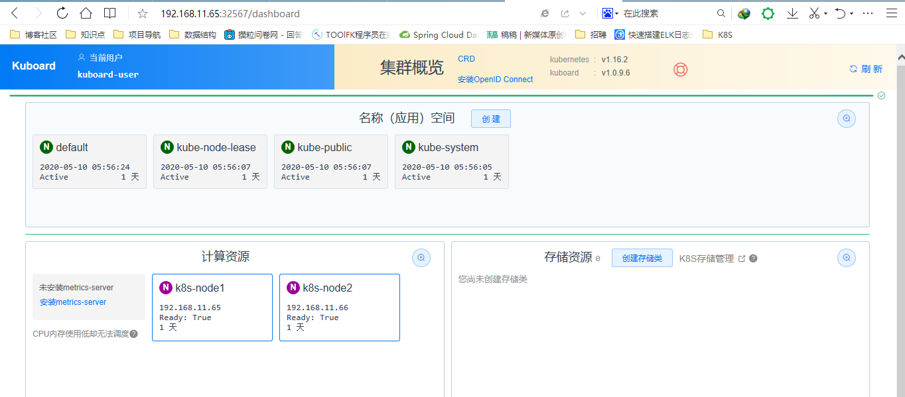

##背景概念
	定义：所谓k8s本质上就是一组服务器集群，k8s可以在集群的各个节点上运行特定的docker容器。

	k8s功能：
		自我修复
		弹性伸缩：实时根据服务器的并发情况，增加或者缩减容器数量
		自动部署
		回滚
		服务发现和负载均衡
		机密和配置共享管理
		
	k8s集群分为两类节点
		master node:	主
		worker node: 工作
		
	master节点的组件（程序）
		apiserver: 接受客户端可k8s的指令
		schduler：从多个woker node节点的组件中选举一个来启动服务
		controller manager：向worker节点的kubelet发送指令
	
	node 节点的组件
		kubelet：向docker发送指令管理docker容器的
		kubeproxy：管理docker容器的网络
		
	etcd
		k8s的数据库
		用来注册节点、服务、记录账户
		
	核心概念
	pod
		pod是k8是最小部署单元
		一个pod中可以有一个或者多个容器一组容器
		pod又称为容器组
	Controllers：控制器 控制pod,启动、停止、删除
		ReplicaSet：确保预期的Pod的副本数量
		（用得较多）Deployment：无状态应用部署
		StatefulSet：有状态应用部署
		DaemonSet：确保所有Node运行同一个Pod
		Job：一次性任务
		Cronjob：定时任务
		
	Services: 服务
		将一组Pod关联起来，提供一个统一的入口
		即使pod地址发生改变，这个统一的入口也不会变化，可以保证用户访问不受影响
		
	label：标签
		一组Pod的标签
		service通过标签和一组pod进行关联
		
	namespace：名称空间
		用来隔离pod的运行环境【默认情况下，pod是可以相互访问的】
		使用场景：
			为不同的公司提供隔离的pod运行环境
			为开发环境、测试环境、生产环境分别准备不同的名称空间进行隔离
		
	k8s是不能直接启动容器
	
	生产配置建议：
		master建议3台
		etcd >= 3 奇数个
		worker越多越好
> 实验环境
> 	三个节点（etcd部署在三个节点上）
> 	2G内存
> 	2核CPU
>
> 生产环境
>
> ​	 三个工作节点 三个主节点 三个etcd节点


一、部署单master集群

​	

```
集群规划
	master	
        IP：192.168.11.63
        主机名：k8s-master1
    worker1
		IP：192.168.11.65
		主机名：k8s-node1
	worker2
		IP：192.168.11.66
		主机名：k8s-node2
		
k8s版本：1.16
安装方式：离线二进制
操作系统版本：centos7
```


二、初始化服务器

	1.关闭防火墙
	【所有节点都执行】
		systemctl stop firewalld
		systemctl disable firewalld
	
	2.关闭selinux
	【所有节点都执行】
		setenforce 0
		vim /etc/selinux/config
		修改：SELINUX=disabled
		
	3.配置主机名
	【所有节点都执行】
		hostnamectl set-hostname 主机名


​			
​	4.配置名称解析
​		vim /etc/hosts
​		【所有节点都执行】
​			192.168.11.63 k8s-master1
​			192.168.11.64 k8s-master2
​			192.168.11.65 k8s-node1
​			192.168.11.66 k8s-node2
​	5.配置时间同步
​		选择一个节点作为服务端，剩下的为客户端
​			master1为时间服务器的服务端
​			其他的为时间服务器的客户端
​			
​			1）配置k8s-master1
​				yum install chrony -y
​				vim /etc/chrony.conf
​				修改三项：
​					server 127.127.1.0 iburst
​					
					allow 192.168.11.0/24
					
					local stratum 10
				# systemctl start chronyd
				# systemctl enable chronyd
				检查进程是否启动
					# ss -unl | grep 123
			2）配置节点
				yum install chrony -y
				vim /etc/chrony.conf
				修改一项：
					server 192.168.11.63 iburst
				# systemctl start chronyd
				# systemctl enable chronyd
				检验配置结果：
				#chronyc sources
					[root@localhost ~]# chronyc sources
					210 Number of sources = 1
					MS Name/IP address         Stratum Poll Reach LastRx Last sample               ===============================================================================
					^* 192.168.11.63                10   6    17     4   +293us[ +538us] +/- 1688us


	6.关闭交换分区
		所有主节点都执行
			swapoff -a
			vim /etc/fstab  
			删除或注释最后一行
		
		检查是否关闭成功swap为0
			[root@localhost ~]# free -m
							   total        used        free      shared  buff/cache   available
				Mem:           1831         135        1499           8         195        1517
				Swap:             0 

三、给etcd颁发证书
	1 创建证书办颁发机构
	2 填写表单
	3 向证书机构申请证书

参考做法：
http://www.codedog.fun/2020/04/12/Kubernetes(k8s)%E4%B8%AA%E4%BA%BA%E7%AC%94%E8%AE%B0(%E6%9B%B4%E6%96%B0%E4%B8%AD)/

给etcd颁发证书
创建证书颁发机构
填写表单–写明etcd所在节点的ip
向证书颁发机构申请证书
下载cfssl工具
(在/home/etcd下)使用cfssl来生成自签证书，先下载cfssl工具：

```
# wget https://pkg.cfssl.org/R1.2/cfssl_linux-amd64

# wget https://pkg.cfssl.org/R1.2/cfssljson_linux-amd64

# wget https://pkg.cfssl.org/R1.2/cfssl-certinfo_linux-amd64

# chmod +x cfssl_linux-amd64 cfssljson_linux-amd64 cfssl-certinfo_linux-amd64

# mv cfssl_linux-amd64 /usr/local/bin/cfssl

# mv cfssljson_linux-amd64 /usr/local/bin/cfssljson

# mv cfssl-certinfo_linux-amd64 /usr/bin/cfssl-certinfo
```

生成证书:编写三个json文件

```
# 我的位置在/home/etcd下，三个json文件创建

# cat ca-config.json

{
  "signing": {
    "default": {
      "expiry": "87600h"
    },
    "profiles": {
      "www": {
         "expiry": "87600h",
         "usages": [
            "signing",
            "key encipherment",
            "server auth",
            "client auth"
        ]
      }
    }
  }
}
```


```
# cat ca-csr.json

{
    "CN": "etcd CA",
    "key": {
        "algo": "rsa",
        "size": 2048
    },
    "names": [
        {
            "C": "CN",
            "L": "Beijing",
            "ST": "Beijing"
        }
    ]
}
```


```
# cat server-csr.json

{
    "CN": "etcd",
    "hosts": [
    "192.168.18.80",
    "192.168.18.85",
    "192.168.18.86"
    ],
    "key": {
        "algo": "rsa",
        "size": 2048
    },
    "names": [
        {
            "C": "CN",
            "L": "BeiJing",
            "ST": "BeiJing"
        }
    ]
}
```

```
#生成证书命令行
cfssl gencert -initca ca-csr.json | cfssljson -bare ca -
cfssl gencert -ca=ca.pem -ca-key=ca-key.pem -config=ca-config.json -profile=www server-csr.json | cfssljson -bare server
```


```
# ls *pem（应该有4个pem结尾的文件）

ca-key.pem  ca.pem  server-key.pem  server.pem
```


四、部署etcd
	etcd需要三台虚拟机
	master node1 node2上分别安装一个etcd

这里使用的是二进制部署

二进制包下载地址：https://github.com/coreos/etcd/releases/

**有etcd的node上都要部署，注意文件夹的名字和位置，不是随便命名和放置的**。

```Linux
#解压压缩包
mkdir /opt/etcd/{bin,cfg,ssl} -p
tar -zxvf etcd-v3.4.7-linux-amd64.tar.gz -C ./
mv etcd-v3.4.7-linux-amd64/{etcd,etcdctl} /opt/etcd/bin/
```

创建etcd配置文件

```
# touch etcd# chmod 777 etcd
# cat /opt/etcd/cfg/etcd  
[Member]
ETCD_NAME="etcd01"
ETCD_DATA_DIR="/var/lib/etcd/default.etcd"
ETCD_LISTEN_PEER_URLS="https://192.168.11.63:2380"
ETCD_LISTEN_CLIENT_URLS="https://192.168.11.63:2379"

[Clustering]
ETCD_INITIAL_ADVERTISE_PEER_URLS="https://192.168.11.63:2380"
ETCD_ADVERTISE_CLIENT_URLS="https://192.168.11.63:2379"
ETCD_INITIAL_CLUSTER="etcd01=https://192.168.11.63:2380,etcd02=https://192.168.11.65:2380,etcd03=https://192.168.11.66:2380"
ETCD_INITIAL_CLUSTER_TOKEN="etcd-cluster"
ETCD_INITIAL_CLUSTER_STATE="new"


#[Security]
ETCD_CERT_FILE="/opt/etcd/ssl/server.pem"
ETCD_KEY_FILE="/opt/etcd/ssl/server-key.pem"
ETCD_TRUSTED_CA_FILE="/opt/etcd/ssl/ca.pem"
ETCD_CLIENT_CERT_AUTH="true"
ETCD_PEER_CERT_FILE="/opt/etcd/ssl/server.pem"
ETCD_PEER_KEY_FILE="/opt/etcd/ssl/server-key.pem"
ETCD_PEER_TRUSTED_CA_FILE="/opt/etcd/ssl/ca.pem"
ETCD_PEER_CLIENT_CERT_AUTH="true"

#-------------------------------------解释-------------------------------------------#ETCD_NAME 节点名称
#ETCD_DATA_DIR 数据目录#ETCD_LISTEN_PEER_URLS 集群通信监听地址
#ETCD_LISTEN_CLIENT_URLS 客户端访问监听地址
#ETCD_INITIAL_ADVERTISE_PEER_URLS 集群通告地址
#ETCD_ADVERTISE_CLIENT_URLS 客户端通告地址
#ETCD_INITIAL_CLUSTER 集群节点地址
#ETCD_INITIAL_CLUSTER_TOKEN 集群Token
#ETCD_INITIAL_CLUSTER_STATE 加入集群的当前状态，new是新集群，existing表示加入已有集群
```

systemd管理etcd

```
# touch /usr/lib/systemd/system/etcd.service
# cat /usr/lib/systemd/system/etcd.service

[Unit]
Description=Etcd Server
After=network.target
After=network-online.targetWants=network-online.target

[Service]
Type=notifyEnvironmentFile=/opt/etcd/cfg/etcd
ExecStart=/opt/etcd/bin/etcd
Restart=on-failure
LimitNOFILE=65536

[Install]
WantedBy=multi-user.target
```


etcd 3.4注意事项
ETCD3.4版本ETCDCTL_API=3 etcdctl 和 etcd --enable-v2=false 成为了默认配置，如要使用v2版本，执行etcdctl时候需要设置ETCDCTL_API环境变量，例如：ETCDCTL_API=2 etcdctl
ETCD3.4版本会自动读取环境变量的参数，所以EnvironmentFile文件中有的参数，不需要再次在ExecStart启动参数中添加，二选一，如同时配置，会触发以下类似报错“etcd: conflicting environment variable "ETCD_NAME" is shadowed by corresponding command-line flag (either unset environment variable or disable flag)”
flannel操作etcd使用的是v2的API，而kubernetes操作etcd使用的v3的API


将之前生成的证书拷贝到固定的目录

```
cp ca*pem server*pem /opt/etcd/ssl
```


启动并设置开机启动

```
systemctl start etcd
systemctl enable etcd
```

注意：以上步骤需要在所有要安装etcd的node上执行一次，不是只在master node上执行，可以通过scp命令发送到其他node，需要改一下etcd的配置文件，节点名和节点ip。

在都部署完成后，检查一下集群的状态(若是出现is healthy，说明部署成功！)

```
[root@k8s-master1 ~]# /opt/etcd/bin/etcdctl --cacert=/opt/etcd/ssl/ca.pem --cert=/opt/etcd/ssl/server.pem --key=/opt/etcd/ssl/server-key.pem --endpoints="https://192.168.11.63:2379,https://192.168.11.65:2379,https://192.168.11.66:2379" endpoint health
https://192.168.11.65:2379 is healthy: successfully committed proposal: took = 151.918486ms
https://192.168.11.63:2379 is healthy: successfully committed proposal: took = 191.130602ms
https://192.168.11.66:2379 is healthy: successfully committed proposal: took = 191.958346ms
```


四、部署Master节点


​	生成证书（和etcd证书不同）

```
# cd /home/k8s在此目录下创建json文件
# cat ca-config.json

{
  "signing": {
    "default": {
      "expiry": "87600h"
    },
    "profiles": {
      "kubernetes": {
         "expiry": "87600h",
         "usages": [
            "signing",
            "key encipherment",
            "server auth",
            "client auth"
        ]
      }
    }
  }
}


# cfssl gencert -initca ca-csr.json | cfssljson -bare ca -
#--------------------------------------------------------------------------------# 
生成apiserver证书
# cat server-csr.json

{
    "CN": "kubernetes",
    "hosts": [
      "10.0.0.1",
      "127.0.0.1",
      "192.168.11.63",
      "kubernetes",
      "kubernetes.default",
      "kubernetes.default.svc",
      "kubernetes.default.svc.cluster",
      "kubernetes.default.svc.cluster.local"
    ],
    "key": {
        "algo": "rsa",
        "size": 2048
    },
    "names": [
        {
            "C": "CN",
            "L": "BeiJing",
            "ST": "BeiJing",
            "O": "k8s",
            "OU": "System"
        }
    ]
}


#cfssl gencert -ca=ca.pem -ca-key=ca-key.pem -config=ca-config.json -profile=kubernetes server-csr.json | cfssljson -bare server
#---------------------------------------------------------------------------------# 
生成kube-proxy证书
# cat kube-proxy-csr.json
{
  "CN": "system:kube-proxy",
  "hosts": [],
  "key": {
    "algo": "rsa",
    "size": 2048
  },
  "names": [
    {
      "C": "CN",
      "L": "BeiJing",
      "ST": "BeiJing",
      "O": "k8s",
      "OU": "System"
    }
  ]
}


# cfssl gencert -ca=ca.pem -ca-key=ca-key.pem -config=ca-config.json -profile=kubernetes kube-proxy-csr.json | cfssljson -bare kube-proxy

#---------------------------------------------------------------------------------# 
[root@k8s-master1 k8s]# ll
总用量 52
-rw-r--r-- 1 root root  294 5月  10 08:31 ca-config.json
-rw-r--r-- 1 root root 1001 5月  10 08:31 ca.csr
-rw-r--r-- 1 root root  264 5月  10 08:31 ca-csr.json
-rw------- 1 root root 1675 5月  10 08:31 ca-key.pem
-rw-r--r-- 1 root root 1359 5月  10 08:31 ca.pem
-rw-r--r-- 1 root root 1009 5月  10 08:34 kube-proxy.csr
-rw-r--r-- 1 root root  230 5月  10 08:34 kube-proxy-csr.json
-rw------- 1 root root 1679 5月  10 08:34 kube-proxy-key.pem
-rw-r--r-- 1 root root 1403 5月  10 08:34 kube-proxy.pem
-rw-r--r-- 1 root root 1245 5月  10 08:33 server.csr
-rw-r--r-- 1 root root  511 5月  10 08:33 server-csr.json
-rw------- 1 root root 1675 5月  10 08:33 server-key.pem
-rw-r--r-- 1 root root 1610 5月  10 08:33 server.pem
有6个以pem结尾的文件，则成功
```


#### 部署apiserver组件

下载二进制包[附百度云链接](https://pan.baidu.com/s/1B_rbab9t6ufY7daSpeuQTg)，里面有3个版本，直接找**kubernetes-server-linux-amd64.tar.gz**即可。

```
# mkdir /opt/kubernetes/{bin,cfg,ssl} -p
# tar -zxvf kubernetes-server-linux-amd64.tar.gz
# cd kubernetes/server/bin
# cp kube-apiserver kube-scheduler kube-controller-manager kubectl /opt/kubernetes/bin
```

创建token文件，用途之后会有用到

```
# cat /opt/kubernetes/cfg/token.csv
674c457d4dcf2eefe4920d7dbb6b0ddc,kubelet-bootstrap,10001,"system:kubelet-bootstrap"

#第一列：随机字符串，自己可生成#第二列：用户名#第三列：UID#第四列：用户组
```

```
将证书复制到/opt/kubernetes/ssl/下，后面组件启动通过该进行目录引用

cp /home/k8s/*.pem  /opt/kubernetes/ssl/
```


创建apiserver配置文件

```
# cat /opt/kubernetes/cfg/kube-apiserver.conf

KUBE_APISERVER_OPTS="--logtostderr=true \
--v=4 \
--log-dir=/opt/kubernetes/logs \
--etcd-servers=https://192.168.11.63:2379,https://192.168.11.65:2379,https://192.168.11.66:2379 \
--bind-address=192.168.11.63 \
--secure-port=6443 \
--advertise-address=192.168.11.63 \
--allow-privileged=true \
--service-cluster-ip-range=10.0.0.0/24 \
--enable-admission-plugins=NamespaceLifecycle,LimitRanger,SecurityContextDeny,ServiceAccount,ResourceQuota,NodeRestriction \
--authorization-mode=RBAC,Node \
--enable-bootstrap-token-auth=true \
--token-auth-file=/opt/kubernetes/cfg/token.csv \
--service-node-port-range=30000-50000 \
--tls-cert-file=/opt/kubernetes/ssl/server.pem  \
--tls-private-key-file=/opt/kubernetes/ssl/server-key.pem \
--client-ca-file=/opt/kubernetes/ssl/ca.pem \
--service-account-key-file=/opt/kubernetes/ssl/ca-key.pem \
--etcd-cafile=/opt/etcd/ssl/ca.pem \
--etcd-certfile=/opt/etcd/ssl/server.pem \
--etcd-keyfile=/opt/etcd/ssl/server-key.pem \
--audit-log-maxage=30 \
--audit-log-maxbackup=3 \
--audit-log-maxsize=100 \
--audit-log-path=/opt/kubernetes/logs/k8s-audit.log"

#----------------------------------------------------------------参数说明：
–logtostderr 启用日志—v 日志等级
–etcd-servers etcd集群地址
-bind-address 监听地址
–secure-port https安全端口
–advertise-address 集群通告地址
–allow-privileged 启用授权
–service-cluster-ip-range Service虚拟IP地址段
–enable-admission-plugins 准入控制模块
–authorization-mode 认证授权，启用RBAC授权和节点自管理
–enable-bootstrap-token-auth 启用TLS bootstrap功能，后面会讲到
–token-auth-file token文件
–service-node-port-range Service Node类型默认分配端口范围
```

systemd管理apiserver

```
# cat /usr/lib/systemd/system/kube-apiserver.service.conf

[Unit]
Description=Kubernetes API ServerDocumentation=https://github.com/kubernetes/kubernetes

[Service]
EnvironmentFile=-/opt/kubernetes/cfg/kube-apiserver
ExecStart=/opt/kubernetes/bin/kube-apiserver $KUBE_APISERVER_OPTS
Restart=on-failure

[Install]
WantedBy=multi-user.target
```

启动

```
# systemctl daemon-reload
# systemctl enable kube-apiserver
# systemctl restart kube-apiserver
```

#### 部署scheduler组件

创建scheduler组件

```
# cat /opt/kubernetes/cfg/kube-scheduler 

KUBE_SCHEDULER_OPTS="--logtostderr=true \
--v=4 \
--master=127.0.0.1:8080 \
--leader-elect"

#---------------------参数说明：
–master 连接本地
apiserver–leader-elect 当该组件启动多个时，自动选举（HA）
```

systemd管理scheduler组件

```
# cat /usr/lib/systemd/system/kube-scheduler.service 

[Unit]

Description=Kubernetes Scheduler
Documentation=https://github.com/kubernetes/kubernetes

[Service]
EnvironmentFile=-/opt/kubernetes/cfg/kube-scheduler

ExecStart=/opt/kubernetes/bin/kube-scheduler $KUBE_SCHEDULER_OPTS
Restart=on-failure

[Install]
WantedBy=multi-user.target
```

启动

```
# systemctl daemon-reload
# systemctl enable kube-scheduler
# systemctl restart kube-scheduler
```

#### 部署controller-manager组件

创建controller-manager组件

```
# cat /opt/kubernetes/cfg/kube-controller-manager 

KUBE_CONTROLLER_MANAGER_OPTS="--logtostderr=true \
--v=4 \--master=127.0.0.1:8080 \
--leader-elect=true \
--address=127.0.0.1 \
--service-cluster-ip-range=10.0.0.0/24 \
--cluster-name=kubernetes \
--cluster-signing-cert-file=/opt/kubernetes/ssl/ca.pem \
--cluster-signing-key-file=/opt/kubernetes/ssl/ca-key.pem  \
--root-ca-file=/opt/kubernetes/ssl/ca.pem \
--service-account-private-key-file=/opt/kubernetes/ssl/ca-key.pem"
```

systemd管理controller-manager组件

```
# cat /usr/lib/systemd/system/kube-controller-manager.service 

[Unit]
Description=Kubernetes Controller ManagerDocumentation=https://github.com/kubernetes/kubernetes

[Service]
EnvironmentFile=-/opt/kubernetes/cfg/kube-controller-manager
ExecStart=/opt/kubernetes/bin/kube-controller-manager $KUBE_CONTROLLER_MANAGER_OPTS

Restart=on-failure

[Install]

WantedBy=multi-user.target
```

启动

```
# systemctl daemon-reload
# systemctl enable kube-controller-manager
# systemctl restart kube-controller-manager
```

**至此，所有组件都启动成功，通过kubectl工具查看当前集群组件状态**

```
[root@k8s-master1 k8s]#  kubectl get cs
NAME                 AGE
controller-manager   <unknown>
scheduler            <unknown>
etcd-2               <unknown>
etcd-0               <unknown>
etcd-1               <unknown>


出现kubectl命令找不到时，将kubectl复制到/bin/ 或者到所在目录下执行
cp /opt/kubernetes/bin/kubectl /bin/
```


配置TLS基于bootstrap自动颁发证书

```
kubectl create clusterrolebinding kubelet-bootstrap \  
--clusterrole=system:node-bootstrapper \  
--user=kubelet-bootstrap
```


四、部署Node节点

​	现在master节点执行，在生成kubernetes证书下执行以下命令生成kubeconfig的文件

```shell
# 创建kubelet bootstrapping kubeconfig 
BOOTSTRAP_TOKEN=674c457d4dcf2eefe4920d7dbb6b0ddc
# 主节点地址
KUBE_APISERVER="https://192.168.11.63:6443"

# 设置集群参数
kubectl config set-cluster kubernetes \
  --certificate-authority=./ca.pem \
  --embed-certs=true \
  --server=${KUBE_APISERVER} \
  --kubeconfig=bootstrap.kubeconfig

# 设置客户端认证参数
kubectl config set-credentials kubelet-bootstrap \
  --token=${BOOTSTRAP_TOKEN} \
  --kubeconfig=bootstrap.kubeconfig

# 设置上下文参数
kubectl config set-context default \
  --cluster=kubernetes \
  --user=kubelet-bootstrap \
  --kubeconfig=bootstrap.kubeconfig

# 设置默认上下文
kubectl config use-context default --kubeconfig=bootstrap.kubeconfig

#-------------------------------------------------------------------
#-------------------------------------------------------------------

# 创建kube-proxy kubeconfig文件

kubectl config set-cluster kubernetes \
  --certificate-authority=./ca.pem \
  --embed-certs=true \
  --server=${KUBE_APISERVER} \
  --kubeconfig=kube-proxy.kubeconfig

kubectl config set-credentials kube-proxy \
  --client-certificate=./kube-proxy.pem \
  --client-key=./kube-proxy-key.pem \
  --embed-certs=true \
  --kubeconfig=kube-proxy.kubeconfig

kubectl config set-context default \
  --cluster=kubernetes \
  --user=kube-proxy \
  --kubeconfig=kube-proxy.kubeconfig

kubectl config use-context default --kubeconfig=kube-proxy.kubeconfig
```

  

```shell
chmod 777 kubernetes.sh
```

生成了**bootstrap.kubeconfig**和**kube-proxy.kubeconfig**两个文件，将这两个文件通过scp发送到所有**Node节点的/opt/kubernetes/cfg**目录下。

将master节点上的kubectl通过scp发送到所有node的/opt/kubernetes/bin下，同时修改**/etc/profile**文件，添加环境变量  export PATH=$PATH:/opt/kubernetes/bin/


将三个pem文件，

​	kubelet.pem 

​	kube-proxy.pem 

​	kube-proxy-key.pem

scp复制到所有node节点的 /opt/kubeternets/ssl 目录下


#### 部署kubelet组件

解压**kubernetes-server-linux-amd64.tar.gz**后，在**/kubernetes/server/bin**下找到**kubelet**和**kube-proxy**两个文件，将这两个文件拷贝到**Node节点的/opt/kubernetes/bin**目录下。

创建kubelet.conf配置文件，修改对应的节点主机名。

```shell
KUBELET_OPTS="--logtostderr=true \
--v=4 \
--log-dir=/opt/kubernetes/logs \
--hostname-override=k8s-node1 \
--kubeconfig=/opt/kubernetes/cfg/kubelet.kubeconfig \
--bootstrap-kubeconfig=/opt/kubernetes/cfg/bootstrap.kubeconfig \
--config=/opt/kubernetes/cfg/kubelet-config.yml \
--cert-dir=/opt/kubernetes/ssl \
--pod-infra-container-image=registry.cn-hangzhou.aliyuncs.com/google-containers/pause-amd64:3.0"

#----------参数说明：
–hostname-override 在集群中显示的主机名
–kubeconfig 指定kubeconfig文件位置，会自动生成
–bootstrap-kubeconfig 指定刚才生成的bootstrap.kubeconfig文件
–cert-dir 颁发证书存放位置
–pod-infra-container-image 管理Pod网络的镜像
```

kubelet-config.yml文件内容

```yml
kind: KubeletConfiguration
apiVersion: kubelet.config.k8s.io/v1beta1
address: 0.0.0.0
port: 10250
readOnlyPort: 10255
cgroupDriver: cgroupfs
clusterDNS: ["10.0.0.2"]
clusterDomain: cluster.local.
failSwapOn: false
authentication:
  anonymous:
    enabled: true
```

systemd管理kubelet组件

```shell
[Unit]
Description=Kubernetes Kubelet
After=docker.service
Requires=docker.service

[Service]
EnvironmentFile=/opt/kubernetes/cfg/kubelet.conf
ExecStart=/opt/kubernetes/bin/kubelet $KUBELET_OPTS
Restart=on-failure
KillMode=process

[Install]
WantedBy=multi-user.target
```

启动

```shell
`# systemctl daemon-reload# systemctl enable kubelet# systemctl restart kubelet`
```

#### 部署kube-proxy组件

创建kube-proxy配置文件kube-proxy.conf ，修改对应的节点主机名。

```
KUBE_PROXY_OPTS="--logtostderr=true \
--v=4 \
--hostname-override=k8s-node1 \
--cluster-cidr=10.0.0.0/24 \
--kubeconfig=/opt/kubernetes/cfg/kube-proxy.kubeconfig"
```

systemd管理Kube-proxy组件

```shell
[Unit]
Description=Kubernetes Proxy
After=network.target

[Service]
EnvironmentFile=-/opt/kubernetes/cfg/kube-proxy.conf
ExecStart=/opt/kubernetes/bin/kube-proxy $KUBE_PROXY_OPTS
Restart=on-failure

[Install]
WantedBy=multi-user.target
```

启动

```shell
# systemctl daemon-reload
# systemctl enable kube-proxy
# systemctl restart kube-proxy
```

上述操作在每个Node节点都要执行。


**上述操作在所有Node节点都要执行，在启动后还是没有加入到集群中，这时需要Master手动允许才可以。**

```shell
# kubectl get csr
	
# kubectl certificate approve XXXXID

# kubectl get node

#-----------------------------------------------------------
如：kubectl get csr
   kubectl certificate approve node-csr-PjBnNDUYsE1soevzLVunyjrCWDEOj_bMUo7ypVuQOXs
```


#### 查看集群状态

```shell
[root@k8s-master1 k8s]# kubectl get node    
NAME        STATUS   ROLES    AGE    VERSION
k8s-node1   Ready    <none>   8h     v1.16.2
k8s-node2   Ready    <none>   5h2m   v1.16.2
```


部署docker 二进制方式行部署

> > **1、download:**
> >
> > 　　https://download.docker.com/linux/static/stable/x86_64/
> >
> > **2、kernel ack**
> >
> > ​	centos 7.x linux3.x的内核在使用docker和k8s时可能存在一些bug，看情况进行升级
> >
> > [root@lab-210 ~]# uname -r     //kerner3.10.+   centois7.x 内核都是3.10+，此举只是为了验证
> > 3.10.0-862.el7.x86_64
> >
> > **3、setup**
> >
> > docker-18.06.1-ce.tgz
> >
> > tar zxf docker-18.06.1-ce.tgz && mv docker/* /usr/bin/ && rm -rf docker*.tgz    //解压切移动binary到 /usr/bin
> >
> > 注意：如果移动到别的目录有点问题，systemctl脚本启动不起来，具体原因还在寻找中
> >
> > **4、systemd docker.service**
> >
> > ```
> > vim /etc/systemd/system/docker.service
> > ```
>
> ```shell
> [Unit]
> Description=Docker Application Container Engine
> Documentation=https:``//docs.docker.com
> After=network-online.target firewalld.service
> Wants=network-online.target
>  
> [Service]
> Type=notify
> # the default is not to use systemd for cgroups because the delegate issues still
> # exists and systemd currently does not support the cgroup feature set required
> # for containers run by docker
> ExecStart=/usr/bin/dockerd -H tcp:``//0.0.0.0:2375 -H unix://var/run/docker.sock
> ExecReload=/bin/kill -s HUP $MAINPID
> # Having non-zero Limit*s causes performance problems due to accounting overhead
> # in the kernel. We recommend using cgroups to do container-local accounting.
> LimitNOFILE=infinity
> LimitNPROC=infinity
> LimitCORE=infinity
> # Uncomment TasksMax if your systemd version supports it.
> # Only systemd 226 and above support this version.
> #TasksMax=infinity
> TimeoutStartSec=0
> # set delegate yes so that systemd does not reset the cgroups of docker containers
> Delegate=yes
> # kill only the docker process, not all processes in the cgroup
> KillMode=process
> # restart the docker process if it exits prematurely
> Restart=``on``-failure
> StartLimitBurst=3
> StartLimitInterval=60s
>  
> [Install]
> WantedBy=multi-user.target
> ```


docker国内加速镜像配置：

```shell
sudo tee /etc/docker/daemon.json <<-'EOF'
{
  "registry-mirrors": ["https://sgbkpdqf.mirror.aliyuncs.com"]
}
EOF
```

启动docker

```shell
# systemctl daemon-reload
# systemctl restart docker

# systemctl enable docker
```


### 十、运行测试

创建控制器，nginx可通过镜像获取，或者下载然后导入docker中

```
kubectl create deployment newweb --image=nginx:1.16.1
```

查看

```
kubectl get  deployment 
```

查看pod

```shell
[root@k8s-master1 ~]# kubectl get pods
NAME                      READY   STATUS    RESTARTS   AGE
myweb-76d97b646c-4z6x8    1/1     Running   0          117m
newweb-64df757cb6-srp95   1/1     Running   0          98m
```

查看pod具体信息

```shell
[root@k8s-master1 ~]# kubectl  describe pod myweb-76d97b646c-4z6x8
Name:         myweb-76d97b646c-4z6x8
Namespace:    default
Priority:     0
Node:         k8s-node2/192.168.11.66
Start Time:   Mon, 11 May 2020 03:41:06 +0800
Labels:       app=myweb
              pod-template-hash=76d97b646c
Annotations:  <none>
Status:       Running
IP:           172.17.0.2
IPs:
  IP:           172.17.0.2
Controlled By:  ReplicaSet/myweb-76d97b646c
Containers:
  nginx:
    Container ID:   docker://5db2e846922ccdab692c453a449738b165779e72699b328780fed06587cfa810
    Image:          nginx:1.16
    Image ID:       docker-pullable://nginx@sha256:d20aa6d1cae56fd17cd458f4807e0de462caf2336f0b70b5eeb69fcaaf30dd9c
    Port:           <none>
    Host Port:      <none>
    State:          Running
      Started:      Mon, 11 May 2020 03:42:53 +0800
    Ready:          True
    Restart Count:  0
    Environment:    <none>
    Mounts:
      /var/run/secrets/kubernetes.io/serviceaccount from default-token-bjlqj (ro)
Conditions:
  Type              Status
  Initialized       True 
  Ready             True 
  ContainersReady   True 
  PodScheduled      True 
Volumes:
  default-token-bjlqj:
    Type:        Secret (a volume populated by a Secret)
    SecretName:  default-token-bjlqj
    Optional:    false
QoS Class:       BestEffort
Node-Selectors:  <none>
Tolerations:     node.kubernetes.io/not-ready:NoExecute for 300s
                 node.kubernetes.io/unreachable:NoExecute for 300s
Events:          <none>
```

端口映射

```
# kubectl expose deployment myweb --port=88  --type=NodePort
```

查看映射的端口

```shell
[root@k8s-master1 ~]# kubectl  get svc
NAME         TYPE        CLUSTER-IP   EXTERNAL-IP   PORT(S)        AGE
kubernetes   ClusterIP   10.0.0.1     <none>        443/TCP        23h
myweb        NodePort    10.0.0.168   <none>        80:37803/TCP   114m
nginx        NodePort    10.0.0.155   <none>        88:34554/TCP   9h
```

访问nginx

```
[root@k8s-master1 ~]# curl http://192.168.11.66:37803

<!DOCTYPE html>
<html>
<head>
<title>Welcome to nginx!</title>
<style>
    body {
        width: 35em;
        margin: 0 auto;
        font-family: Tahoma, Verdana, Arial, sans-serif;
    }
</style>
</head>
<body>
<h1>Welcome to nginx!</h1>
<p>If you see this page, the nginx web server is successfully installed and
working. Further configuration is required.</p>

<p>For online documentation and support please refer to
<a href="http://nginx.org/">nginx.org</a>.<br/>
Commercial support is available at
<a href="http://nginx.com/">nginx.com</a>.</p>

<p><em>Thank you for using nginx.</em></p>

</body>
</html>
```


管理界面


### 十一、安装kuboard可视化界面

- ```shell
  # 可以在master节点执行以下命令
  kubectl apply -f https://kuboard.cn/install-script/kuboard.yaml
  ```

- ```
  # 查看kuboard运行状态
  [root@k8s-master1 cfg]# kubectl get pods -l k8s.eip.work/name=kuboard -n kube-system
  NAME                       READY   STATUS    RESTARTS   AGE
  kuboard-756d46c4d4-n6px6   1/1     Running   1          71m
  ```

- ```shell
  # 获取Token,登录界面需要token
  [root@k8s_master1 ~]# kubectl -n kube-system get secret $(kubectl -n kube-system get secret | grep kuboard-user | awk '{print $1}') -o go-template='{{.data.token}}' | base64 -
  
  deyJhbGciOiJSUzI1NiIsImtpZCI6IiJ9.eyJpc3MiOiJrdWJlcm5ldGVzL3NlcnZpY2VhY2NvdW50Iiwia3ViZXJuZXRlcy5pby9zZXJ2aWNlYWNjb3VudC9uYW1lc3BhY2UiOiJrdWJlLXN5c3RlbSIsImt1YmVybmV0ZXMuaW8vc2VydmljZWFjY291bnQvc2VjcmV0Lm5hbWUiOiJrdWJvYXJkLXVzZXItdG9rZW4tOXQ5ZGIiLCJrdWJlcm5ldGVzLmlvL3NlcnZpY2VhY2NvdW50L3NlcnZpY2UtYWNjb3VudC5uYW1lIjoia3Vib2FyZC11c2VyIiwia3ViZXJuZXRlcy5pby9zZXJ2aWNlYWNjb3VudC9zZXJ2aWNlLWFjY291bnQudWlkIjoiMWJlMDUxMWItN2I3ZC0xMWVhLWIxMDUtMDAwYzI5YWVhZTQ1Iiwic3ViIjoic3lzdGVtOnNlcnZpY2VhY2NvdW50Omt1YmUtc3lzdGVtOmt1Ym9hcmQtdXNlciJ9.WqqZGdn_rFBhNiJRYFOT088-afLI3m88IP0U4wJuEbYSwuUkhDodf67j76WpITnCdL5t_dsHJeKBHs9mAUHcUiZIqaCrnPXgsvh7sxi9IhD5CGFj1DqzstiGThGQmY7Su3w1SO-KrmInkfWwkaFIqLjvKUhjxzX4OoO_fJgdLdeUZOAF1gbNg_TC98IhZPFE-qlKTaL2u_5o1OxpzKVWx5z52G6eqeTZiprq39_rhpKQElU3IBLAyU6CtLsmxFF66kxgj9qPaYzpHV6U_Hsw0KtX3qEcNbC0GIxOEw4HFNDABzSUx4dATVWKfg9zeldz5gJB7AumZmmz63lfqFAOIw
  ```

- ```shell
  # 查看暴露的端口32567
  
  [root@k8s-master1 cfg]# kubectl get svc -n kube-system
  NAME      TYPE       CLUSTER-IP   EXTERNAL-IP   PORT(S)        AGE
  kuboard   NodePort   10.0.0.224   <none>        80:32567/TCP   72m
  ```

- ```
  # 任意一个node节点ip:32567  
  # http://192.168.18.65:32567
  ```

这边只有一个节点65可以访问，可能网络前面步骤中没有配置的原因。kubelet.conf 没有去开启cni 配置fannel网络。




未完待续。。。。


	题外话：
	
	centos7 
		systemd的服务管理脚本
		/usr/lib/systemd/system
		
	centos6
		sysV风格的服务管理脚本
		/etc/rc.d/rcN.d


​	
​	##########################################
​	加密
​		对称加密：加密解密用相同的密钥
​		非对称加密：对公钥~私钥的密钥实现加解密
​		单向加密：只能加密，不能解密


​			


数据最好是 >= 3 奇数个 

APISERVER：所有服务访问统一入口
CrontrollerManager：维持副本期望数目
Scheduler：负责介绍任务，选择合适的节点进行分配任务
ETCD：键值对数据库  储存K8S集群所有重要信息（持久化）
Kubelet：直接和容器引擎交互实现容器的生命周期管理
Kube-proxy：负责写入规则至IPTABLES、IPVS实现服务映射访问的

COREDNS：可以为集群中的SVC创建一个域名IP的对应关系解析
DASHBOARD：给K8S提供一个B/S的机构访问体系
INGRESS CONTROLLER:官方只能实现四层代理，INGRESS可以实现七层代理
FEDERATION: 提供一个可以跨集群中心多K8S统一管理功能
PROMETHEUS: 提供K8S集群的监控能力
ELK：提供K8S集群日志统一分析介入平台