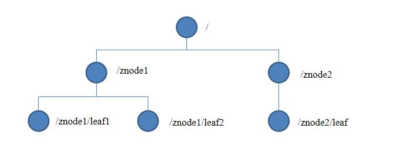
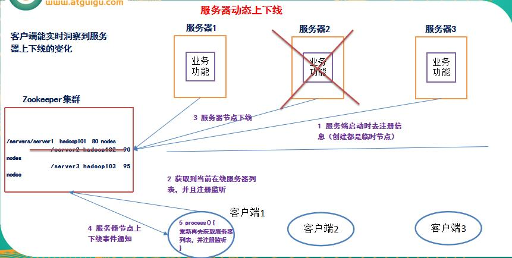
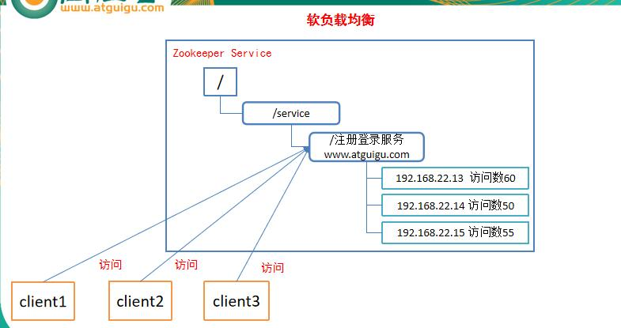
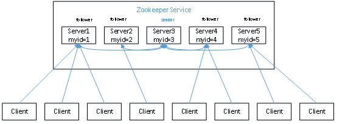
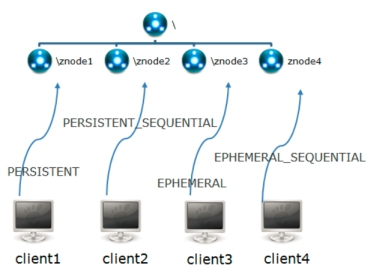
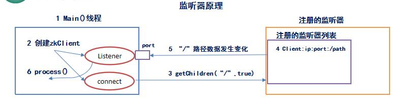
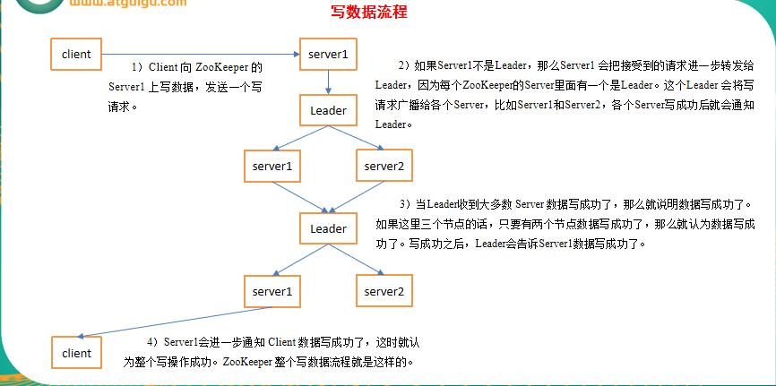

### 1.What is ZooKeeper?

### 1.1官方概述

> ZooKeeper is a centralized service for maintaining configuration information, naming, providing distributed synchronization, and providing group services. All of these kinds of services are used in some form or another by distributed applications. Each time they are implemented there is a lot of work that goes into fixing the bugs and race conditions that are inevitable. Because of the difficulty of implementing these kinds of services, applications initially usually skimp on them, which make them brittle in the presence of change and difficult to manage. Even when done correctly, different implementations of these services lead to management complexity when the applications are deployed.
>
> ZooKeeper 是一个集中的服务，用于维护配置信息、命名、提供分布式同步和提供组服务。所有这些类型的服务都以某种形式被分布式应用程序使用。每次实现它们时，都会有大量的工作用于修复不可避免的bug和争用条件。由于实现这类服务的难度，最初应用程序通常会对它们进行简化，这使得它们在发生变化时变得脆弱，难以管理。即使正确完成，在部署应用程序时，这些服务的不同实现也会导致管理复杂性。
>
> ——引自ZooKeeper官网

### 1.2.工作机制

​	Zookeeper从设计模式角度来理解：是一个基于观察者模式设计的分布式服务管理框架，它负责存储和管理大家都关心的数据，然后接受观察者的注册，一旦这些数据的状态发生变化，Zookeeper就将负责通知已经在Zookeeper上注册的那些观察者做出相应的反应，从而实现集群中类似Master/Slave管理模式。

## 2.特点

### 	2.1集群

​	

1. ​	Zookeeper:一个Leader,多个Follwer组成集群

2. ​	Leader负责进行投票的发起和决议，更新系统状态

3. ​	Follower用于接收客户请求并向客户端返回结果，在选举Leader过程中参与投票

4. ​    集群中只要有半数以上的节点存活，Zookeeper就可以正常服务

5. ​    全局数据一致：每个server保存一份相同的数据副本，client无论连接到哪个server，数据都是一致的。

6. ​    更新请求顺序进行，来自同一个client的更新请求按其发送顺序依次执行。

7. ​    数据更新原子性，一次数据更新要么成功，要么失败。

8. ​    实时性，在一定时间范围内，client能读到最新数据。

	

## 3 数据结构

​	ZooKeeper数据模型的结构与Unix文件系统很类似，整体上可以看作是一棵树，每个节点称做一个ZNode。每一个ZNode默认能够存储1MB的数据，每个ZNode都可以通过其路径唯一标识。

## 4.应用场景

​	提供的服务包括：统一命名服务、统一配置管理、统一集群管理、服务器节点动态上下线、软负载均衡等。

### 	4.1 统一命名服务

​			在分布式环境下，经常需要对应用/服务进行统一命名，便于识别不同服务。
​			（1）类似于域名与ip之间对应关系，ip不容易记住，而域名容易记住。
​			（2）通过名称来获取资源或服务的地址，提供者等信息。

### 	4.2 统一配置管理

​			1）分布式环境下，配置文件管理和同步是一个常见问题。
​				（1）一个集群中，所有节点的配置信息是一致的，比如 Hadoop 集群。
​				（2）对配置文件修改后，希望能够快速同步到各个节点上。
​			2）配置管理可交由ZooKeeper实现。
​				（1）可将配置信息写入ZooKeeper上的一个Znode。
​				（2）各个节点监听这个Znode。
​				（3）一旦Znode中的数据被修改，ZooKeeper将通知各个节点。

### 	4.3 统一集群管理

​			1）分布式环境中，实时掌握每个节点的状态是必要的。
​				（1）可根据节点实时状态做出一些调整。
​			2）可交由ZooKeeper实现。
​				（1）可将节点信息写入ZooKeeper上的一个Znode。
​				（2）监听这个Znode可获取它的实时状态变化。
​			3）典型应用
​				（1）HBase中Master状态监控与选举。

### 	4.4 服务器动态上下线

​			客户端能实时洞察到服务器上下线的变化

​		

### 	4.5 软负载均衡

​			

## 5.安装配置

​	配置参数解读

​	1）tickTime：通信心跳数，Zookeeper服务器心跳时间，单位毫秒

​		Zookeeper使用的基本时间，服务器之间或客户端与服务器之间维持心跳的时间间隔，也就是每个tickTime时		间就会发送一个心跳，时间单位为毫秒。

​		它用于心跳机制，并且设置最小的session超时时间为两倍心跳时间。(session的最小超时时间2*tickTime)。

2）initLimit：LF初始通信时限
		集群中的follower跟随者服务器(F)与leader领导者服务器(L)之间初始连接时能容忍的最多心跳数（tickTime的		数量），用它来限定集群中的Zookeeper服务器连接到Leader的时限。

​		投票选举新leader的初始化时间。

​		Follower在启动过程中，会从Leader同步所有最新数据，然后确定自己能够对外服务的起始状态。Leader允		许F在initLimit时间内完成这个工作。

3）syncLimit：LF同步通信时限

​	集群中Leader与Follower之间的最大响应时间单位，假如响应超过syncLimit * tickTime，Leader认为Follwer	死掉，从服务器列表中删除Follwer。

​	在运行过程中，Leader负责与ZK集群中所有机器进行通信，例如通过一些心跳检测机制，来检测机器的存活状	态。

​	如果L发出心跳包在syncLimit之后，还没有从F那收到响应，那么就认为这个F已经不在线了。

4）dataDir：数据文件目录+数据持久化路径

​	保存内存数据库快照信息的位置，如果没有其他说明，更新的事务日志也保存到数据库。

5）clientPort=2181：客户端连接服务器端口

## 6.Zookeeper内部原理

### 	6.1选举机制		

1）半数机制：集群中半数以上机器存活，集群可用。所以zookeeper适合装在奇数台机器上。

2）Zookeeper虽然在配置文件中并没有指定master和slave。但是，zookeeper工作时，是有一个节点leader，	  其他则为follower，Leader是通过内部的选举机制临时产生的。

3）以一个简单的例子来说明整个选举的过程。

假设有五台服务器组成的zookeeper集群，它们的id从1-5，同时它们都是最新启动的，也就是没有历史数据，在存放数据量这一点上，都是一样的。假设这些服务器依序启动，来看看会发生什么。

（1）服务器1启动，此时只有它一台服务器启动了，它发出去的信息没有任何响应，所以它的选举状态一直是

​		  LOOKING状态。

（2）服务器2启动，它与最开始启动的服务器1进行通信，互相交换自己的选举结果，由于两者都没有历史数据，		  所以id值较大的服务器2胜出，但是由于没有达到超过半数以上的服务器都同意选举它(这个例子中的半数以 		 上是3)，所以服务器1、2还是继续保持LOOKING状态。

（3）服务器3启动，根据前面的理论分析，服务器3成为服务器1、2、3中的老大，而与上面不同的是，此时有三		  台服务器选举了它，所以它成为了这次选举的leader。per实战

（4）服务器4启动，根据前面的分析，理论上服务器4应该是服务器1、2、3、4中最大的，但是由于前面已经有		  半数以上的服务器选举了服务器3，所以它只能接收当小弟的命了。

（5）服务器5启动，同4一样当小弟。

### 	6.2 节点类型

​		1）Znode有两种类型：

​				短暂（ephemeral）：客户端和服务器端断开连接后，创建的节点自动删除

​				持久（persistent）：客户端和服务器端断开连接后，创建的节点不删除

​		2）Znode有四种形式的目录节点（默认是persistent ）

​			（1）持久化目录节点（PERSISTENT）

​					客户端与zookeeper断开连接后，该节点依旧存在

​			（2）持久化顺序编号目录节点（PERSISTENT_SEQUENTIAL）

​					客户端与zookeeper断开连接后，该节点依旧存在，只是Zookeeper给该节点名称进行顺序编号

​			（3）临时目录节点（EPHEMERAL）

​					客户端与zookeeper断开连接后，该节点被删除

​			（4）临时顺序编号目录节点（EPHEMERAL_SEQUENTIAL）

​					客户端与zookeeper断开连接后，该节点被删除，只是Zookeeper给该节点名称进行顺序编号

 

​		3）创建znode时设置顺序标识，znode名称后会附加一个值，顺序号是一个单调递增的计数器，由父节点维			  护

​		4）在分布式系统中，顺序号可以被用于为所有的事件进行全局排序，这样客户端可以通过顺序号推断事件的			  顺序

### 6.3 stat结构体（节点的状态）

1）czxid- 引起这个znode创建的zxid，创建节点的事务的zxid

​		每次修改ZooKeeper状态都会收到一个zxid形式的时间戳，也就是ZooKeeper事务ID。

​		事务ID是ZooKeeper中所有修改总的次序。每个修改都有唯一的zxid，如果zxid1小于zxid2，那么zxid1在		zxid2之前发生。

2）ctime - znode被创建的毫秒数(从1970年开始)
3）mzxid - znode最后更新的zxid
4）mtime - znode最后修改的毫秒数(从1970年开始)
5）pZxid-znode最后更新的子节点zxid
6）cversion - znode子节点变化号，znode子节点修改次数
7）dataversion - znode数据变化号
8）aclVersion - znode访问控制列表的变化号
9）ephemeralOwner- 如果是临时节点，这个是znode拥有者的session id。如果不是临时节点则是0。
10）dataLength- znode的数据长度
11）numChildren - znode子节点数量

### 6.4 监听原理（重点）

1）监听原理详解：
		（1）首先要有一个main()线程
		（2）在main线程中创建Zookeeper客户端，这时就会创建两个线程，一个负责网络连接通信（connet），				  一个负责监听（listener）。
		（3）通过connect线程将注册的监听事件发送给Zookeeper。
		（4）在Zookeeper的注册监听器列表中将注册的监听事件添加到列表中。
		（5）Zookeeper监听到有数据或路径变化，就会将这个消息发送给listener线程。
		（6）listener线程内部调用了process（）方法。

2）常见的监听
（1）监听节点数据的变化：
			get path [watch]
（2）监听子节点增减的变化
			ls path [watch]

6.5 写数据流程

